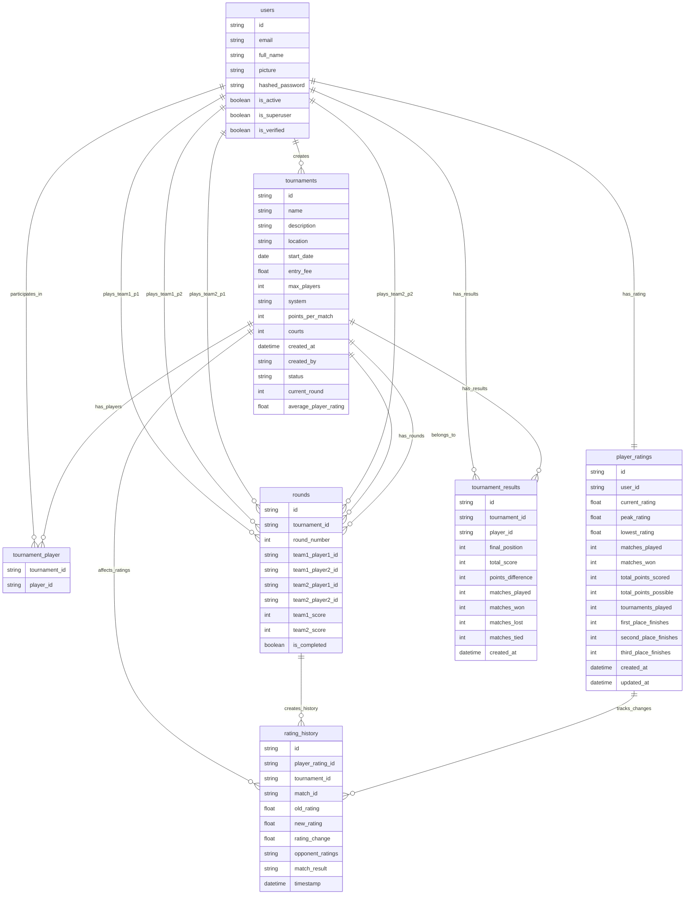

# PadelPoints Database ER Diagram

## Mermaid ER Diagram

## Database Relationships Summary

### Core Entities

1. **users** - Central user entity
   - Has one player_rating (1:1)
   - Can create many tournaments (1:N)
   - Can participate in many tournaments (M:N via tournament_player)
   - Can play in many rounds (1:N, as 4 different player positions)
   - Has many tournament_results (1:N)

2. **tournaments** - Tournament management
   - Created by one user (N:1)
   - Has many players (M:N via tournament_player)
   - Has many rounds (1:N)
   - Has many tournament_results (1:N)
   - Creates rating_history entries (1:N)

3. **rounds** - Match/game tracking
   - Belongs to one tournament (N:1)
   - Has 4 player relationships (N:1 each)
   - Creates rating_history entries (1:N)

4. **player_ratings** - ELO rating system
   - Belongs to one user (1:1)
   - Has many rating_history entries (1:N)

5. **rating_history** - Rating change tracking
   - References player_rating (N:1)
   - References tournament (N:1)
   - References round/match (N:1)

6. **tournament_results** - Final tournament standings
   - References tournament (N:1)
   - References user/player (N:1)
   - Unique constraint on (tournament_id, player_id)

7. **tournament_player** - Join table for M:N relationship
   - Links users and tournaments

### Key Relationships

- **Many-to-Many**: Users ↔ Tournaments (via tournament_player)
- **One-to-One**: Users → PlayerRatings
- **One-to-Many**:
  - Tournaments → Rounds
  - Tournaments → TournamentResults
  - Users → CreatedTournaments
  - PlayerRatings → RatingHistory
- **Complex**: Rounds have 4 separate foreign keys to Users (for team compositions)

### Business Rules Enforced by Schema

1. Each user can have only one player rating
2. Each tournament-player result combination is unique
3. Rounds track exactly 4 players (2 teams of 2)
4. Rating history tracks changes per match and tournament
5. Tournament status follows enum values (pending, active, completed)
6. Tournament system follows enum values (AMERICANO, MEXICANO)